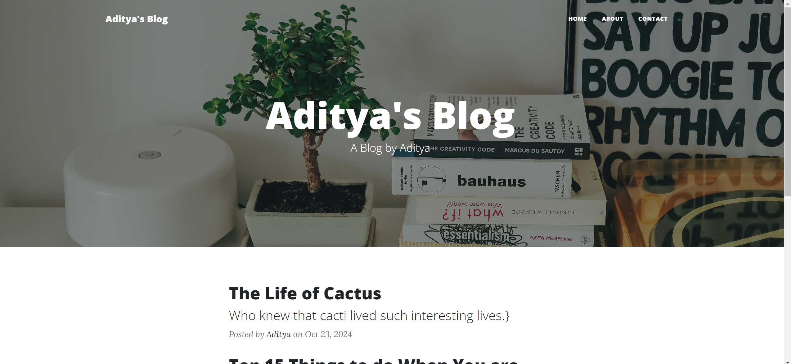

# 🌟 Welcome to Aditya's Blog! 🌟

Hey there! 👋 I'm Aditya, and this is my **Blog**, a cozy corner of the internet where I share my thoughts, ideas, and coding adventures! This project showcases my web development skills and is powered by some amazing technology. Let’s dive in!



## 📚 Table of Contents

- [✨ Project Overview](#project-overview)
- [🎉 Features](#features)
- [🔧 Project Structure](#project-structure)
- [🛠️ Technologies Used](#technologies-used)
- [📥 Installation](#installation)
- [🚀 Usage](#usage)
- [📜 License](#license)
- [📫 Contact](#contact)

## ✨ Project Overview

Welcome to my digital diary! 📝 This blog is all about sharing knowledge and experiences through beautifully crafted articles fetched from a third-party API. It's a great way to keep my skills sharp while connecting with fellow tech enthusiasts!

## 🎉 Features

- **Responsive Design**: Works seamlessly on all devices—your phone, tablet, or desktop!
- **Dynamic Content**: Fresh blog posts are just a click away, thanks to real-time API calls.
- **User-Friendly Navigation**: Explore effortlessly with easy access to Home, About, and Contact pages.
- **Social Media Links**: Let's connect! Check out my LinkedIn and GitHub profiles.

## 🔧 Project Structure

Here's a sneak peek into the inner workings of my blog:

```
blog-website/
│
├── static/                    # All things static (CSS, JS, images)
│   ├── assets/                # Cool assets to enhance your experience
│   ├── img/                   # Eye-catching blog images
│   └── js/                    # JavaScript magic
│
├── templates/                 # HTML templates that bring it all together
│   ├── header.html            # Header template (where the magic begins!)
│   ├── footer.html            # Footer template (for that perfect finish)
│   ├── home.html              # Your landing pad
│   ├── about.html             # All about me!
│   ├── contact.html           # Let’s chat!
│   └── post.html              # The blog post template for all my ramblings
│
├── app.py                     # The wizard behind the curtain
├── requirements.txt           # Your magic potion for dependencies
└── README.md                  # You're reading it now!
```

## 🛠️ Technologies Used

Here’s what powers my blog:

- **Frontend**: HTML, CSS, Bootstrap (making things pretty)
- **Backend**: Flask (Python) (the brains of the operation)
- **API**: Fetching blog content like a pro!

## 📥 Installation

Ready to roll? Just follow these simple steps to get started:

1. **Clone the repository**:
   ```bash
   git clone https://github.com/Aditya1066/blog-website.git
   cd blog-website
   ```

2. **Install dependencies**:
   ```bash
   pip install -r requirements.txt
   ```

3. **Run the application**:
   ```bash
   python app.py
   ```

4. **Open your browser** and navigate to `http://127.0.0.1:5000`. Voilà! 🎉

## 🚀 Usage

Navigate through the blog to discover exciting posts and insights. Explore the Home, About, and Contact pages, and enjoy the content that updates in real time!

## 📜 License

This project is licensed under the MIT License. Feel free to check out the [LICENSE](LICENSE) file for the nitty-gritty details.

## 📫 Contact

I’d love to hear from you! For inquiries, feedback, or just a friendly chat, reach out to me:

- **Email**: [aditya.agarwal1066@gmail.com](mailto:aditya.agarwal1066@gmail.com)
- **LinkedIn**: [Aditya Agarwal](https://www.linkedin.com/in/aditya1066)
- **GitHub**: [Aditya1066](https://github.com/Aditya1066)

---

Thank you for stopping by! 🚀 Explore, enjoy, and let’s connect over tech, blogs, and all things interesting! Happy coding! 🎉
